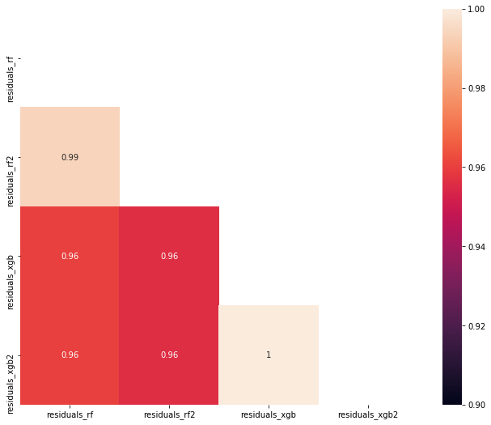
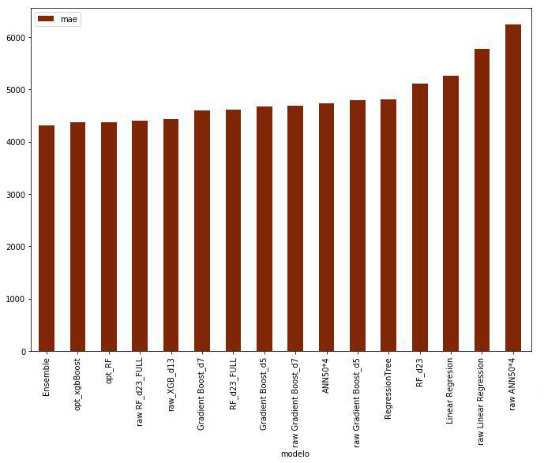
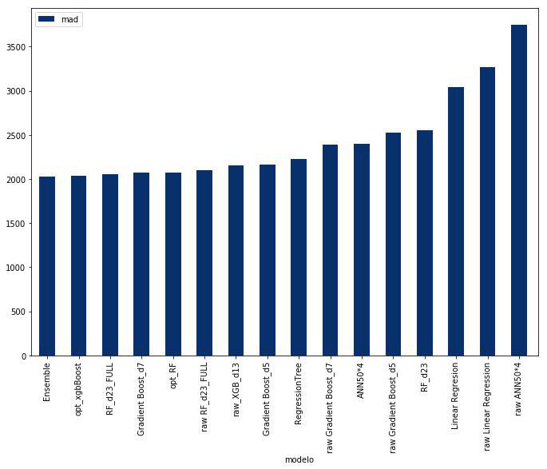

# Salesforce-Predictive-Modelling-Always Learning Deeper

## AlwaysLearningDeeper submission for UniversityHack 2018 DATATHON, 2nd place

## Introduction

This project is the AlwaysLearningDeeper submission for UniversityHack 2018 DATATHON(http://www.cajamardatalab.com/datathon-cajamar-universityhack-2018/) a Spanish national contest where only students can participate (from Bachelor level to Phd).

Our team consists of:
* Jaime Ferrando Huertas Data Scientist @Polystar, Stockholm
* Javier Iranzo Sánchez  Reseach Intern @MLLP Research Group, UPV
* Javier Rodríguez Domínguez Intern @ITI, UPV

The goal for the Salesforce Predictive Modelling track was to predict the purchasing power of a client, using data provided by Spanish bank Cajamar. 

The data consisted in a series of continuous and categorical anonymized variables, so the preprocessing of this data is quite difficult in terms of demographic analysis. The target variable is called *Poder Adquisitivo*. It is a continuous value so we are facing a regression problem. 

Here we show a brief explanation of our submission, based on the slides presented at the contest's final.

## Technologies used for this project:
*  Python
*  Sklearn
*  Pandas
*  XGBoost
*  Tensorflow
*  Bayes-opt

## Data processing

This variable presents a distribution with a few clients with very different values from the mean. We can consider those values as outliers, as they will be a source of problems.

The following methods reported increases in performance:
* Transform categorical variables into one-hot vectors
* Group values with a large number of instances in these categorical variables, in order to reduce the dimensionality of the one-hot vector
* Delete the index variable ID Customer

The following techniques didn't have a positive impact so we decided not to use them:
* Eliminate outliers
* Use scaling
* Model differently outliers and normal clients
* Create an artificial variable for outlier detection (needing a model to predict that variable for new samples)

## Training

We have tried more than 100 different models and hyperparameter combinations, such as:
* Linear Regression 
* Decision Tree
* Random Forest
* Gradient Boosting
* XGBoost
* Deep neural networks
* SVM, KNN, Lasso, Ridge, ElasticNet
* Different ensembles with the previous models

### Optimizing hyperparameters

After trying all the possible models and selecting the ones with best results we moved to optimize the hyperparameters of those models. This can be seen as optimizing a function whose input are the hyperparameters and whose output is the model performance measure. Optimizing this function is hard to due the following problems:
* The function is very expensive to sample because we need to train a new model each time
* We have an infinite number of possible hyperparameters 
* We do not know the interactions between these hyperparameters

To solve this problem we used Bayesian Optimization (bayes-opt package in python)

### Ensembling

A second option to improve our model was to ensemble different models whose errors are not correlated, because we would not obtain noticable improvements otherwise. 

Our goal is to build a combination of models where the errors of one model can be compensated by the predictions made by the rest of the models.

### Final model

To obtain our final model we used an ensemble between XGBoost and RandomForest (with hyperparameters optimized by bayesian optimization), that are two of the best models right now for regression problems.

## Prediction

When entering the prediction phase we wanted to ensure that we use the correct metrics to measure our performance (remember our outliers problem). We first started with the root-mean-square error (RMSE), but it is an outlier sensible metric so we changed to mean absolute error (MAE) where those outliers don't make a huge impact. We also used median absolute deviation (MAD) thanks to its insensibility to outliers, we tested both of our models with MAE and MAD. We can see some charts now with the results obtained:

## Conclusion

Our finals results for 5-fold Cross-Validation are as follows:
* MAE of 4318 euros
* MAD of 2028 euros

Now that we have finished the challenge we want to list the most important things to do when facing a problem of this kind. Some of them were learnt during the challenge, apart from the ones we knew beforehand:

* Perform an exhaustive study of the data distribution
* Spend time with data preprocessing, it is what usually makes the difference, as nowadays models are being easier to implement
* Distinguish between model selection and model optimization
* RandomForest models can obtain state of the art results when facing regression problems

We want to express our how excited we were about this contest. Last year we couldn't pariticpate due to the non acceptance of bachelor students, but that aspect has changed in this year edition. It has been a pleasure to take part in it and we are looking forward to next year edition.
