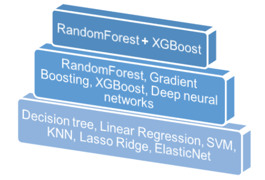

# Salesforce-Predictive-Modelling-Always Learning Deeper

AlwaysLearningDeeper submission for UniversityHack 2018 DATATHON

Jaime Ferrando Huertas Data Scientist@Polystar, Stockholm

Javier Iranzo Sánchez  Intern@MLLP Research Group, UPV

Javier Rodríguez Domínguez Intern@ITI, UPV

## Technologies used for this proyect:
*  Python
*  Sklearn
*  Pandas
*  XGBoost
*  Tensorflow
*  Bayes-opt

## Data processing

Its a data distribution that shows us that there are a few clients with values extremely different from the normal, those clients are called outliers and will cause problems later on.

Regarding our preprocessing we can see what methods reported benefits:
⋅⋅* Transform categorial variables into one-hot vectors
⋅⋅* Group values in those categorial variables with a large espectrum of values to compress the one-hot vector
⋅⋅* Delete the index variable ID Customer

And also some others that didn't make an impact so we decided not to use them
⋅⋅* Eliminate outliers
⋅⋅* Use scaling
⋅⋅* Model differently for outliers and normal clients
⋅⋅* Create an artifical variable for outlier detection (needing a model to predict that variable for new samples)

## Training

We have tried over 100 different models with more hyperparameter combinations but this is a selection:
* Linear Regression 
* Decision Tree
* Random Forest
* Gradient Boosting
* XGBoost
* Deep neural networks
* SVM, KNN, Lasso, Ridge, ElasticNet
* Different ensembles with the previous models

### Optimizing hyperparameters

After trying all the possible models and selecting the ones with best results we moved to optimize the parameters of those models. This can be seen as optimizing a function where the input are those hyperparameters and the output it's the model performance. To do this in an effient way was a problem for us. Here's why:
* Function that is really hard to evaluate, we need to train a model everytime
* We have a huge space of possible hyperparameters
* We don't really understand that hyperparameter structure and how they interact between them

To solve this we used Bayesian Optimization (bayes-opt package in python)

### Ensembling

A second option to improve our model was to ensemble different models that doesn't perform the same mistakes (ensembling models with the same mistakes would make no improve at all).

Therefore we want to buil a combination of models where some model errors can be solved by the other model.

### Final model

To our final model we used an ensemble between XGBoost and RandomForest (with hyperparameters optimizied by bayesian optimization). Two of the best models right now for regression problems.

## Predicting

When entering the prediction phase we wanted to ensure that we use the correct metrics to measure our problem (remember our outliers problem). We first started with the root-mean-square error (RMSE) but that's a outlier sensible metric so we changed to mean absolute error (MAE) where those outliers doesn't make a huge impact. We also used median absolute deviation (MAD) thanks to it's insensibilty to outliers, we tested both of our models with MAE and MAD. We can see some charts now with the results obtained:

## Conlusion

Our finals results were:
* MAE error of 4318 euros
* MAD error of 2028 euros

Now that we finished the challenge we want to list the most important things to do when facing a problem of this kind, there are some that we learned while the challenge and others we already knew.

* To do an exhaustive study of the data distribution.
* Spend time with data preprocessing, it what usually makes the difference as nowadays models are being easier to implement.
* Distinguish between model selection and model optimization
* RandomForest are now top of the art when facing regression problems

